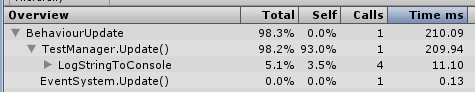

Unity.Profiler.Ext
====
https://github.com/pjc0247/unifiler 이전에 거쳐가는 프로젝트<br>
<br>
유니티 프로파일러에 정확한 콜그래프를 추가해줍니다.

```cs
public void Update()
{
    Debug.Log("A");
    Bar(1, 2);
    Zoo();
    UnityEngine.Debug.Log("DEBUG");
}
```

<br>
<br>
