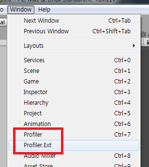

Unity.Profiler.Ext
====
유니티 프로파일러에 정확한 콜그래프를 추가해줍니다.

```cs
public void Update()
{
    Debug.Log("A");
    Bar(1, 2);
    Zoo();
    UnityEngine.Debug.Log("DEBUG");
}
```

<br>
<br>

사용법
----
* [다운로드] 페이지에서 다운받은 패키지를 추가합니다.
* Window/Profiler.Ext 버튼을 클릭하면 프로파일러가 표시됩니다.


